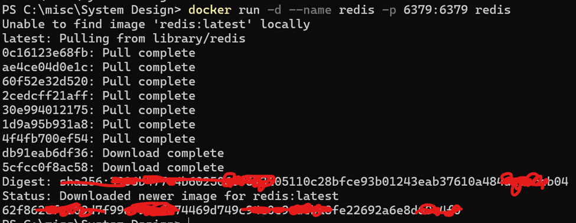
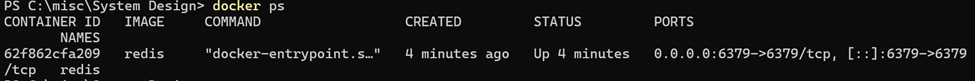
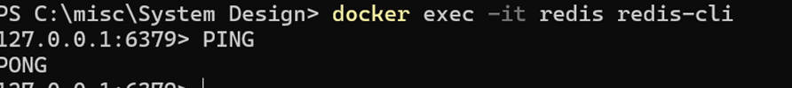
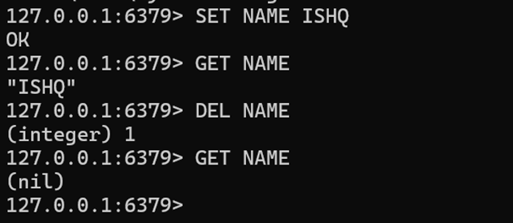
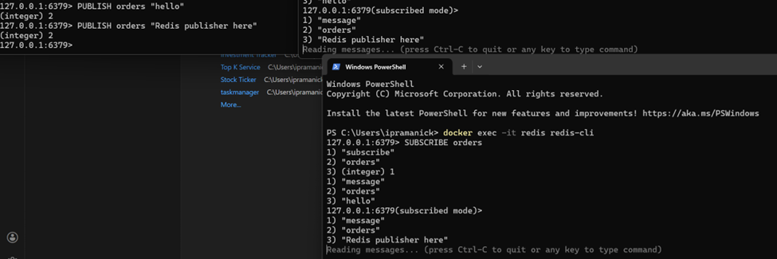

# Redis Pub/Sub with Docker on Windows

## Prerequisites

- Docker Desktop installed on Windows

---

## Setup Instructions

### 1. Install & Run Docker Desktop

Download and install Docker Desktop from [docker.com](https://www.docker.com/products/docker-desktop/), then start the application.

---

### 2. Run Redis Container

Open PowerShell and run the following command:

```powershell
docker run -d --name redis -p 6379:6379 redis
```

---

### 3. Verify Container is Running

```powershell
docker ps
```

---

### 4. Connect to Redis CLI

After ensuring Redis is running, connect to it:

```powershell
docker exec -it redis redis-cli
```

---

### 5. Test Connection

Ping Redis to verify it's working:

```
PING
```

Expected response: `PONG`

---

### 6. Basic Redis Commands

| Command | Description |
|---------|-------------|
| `SET key value` | Set a key-value pair |
| `GET key` | Get the value of a key |
| `DEL key` | Delete a key |

**Examples:**

```
SET mykey "Hello World"
GET mykey
DEL mykey
```

---

### 7. Open Multiple Subscribers

Open 2 or more additional terminals and connect each as a subscriber:

```powershell
docker exec -it redis redis-cli
```

---

### 8. Understanding Multiple Connections

Each time you run `docker exec -it redis redis-cli`, Docker does the following:

1. **Enters the same running container**
2. **Starts a new redis-cli process**
3. **That process opens a new TCP connection to Redis**
4. **All connections go to `127.0.0.1:6379`**
5. **Same port. Different connections.**

#### Analogy

Think of port `6379` as:

> 🏢 **One office address**
> - Multiple people can walk in at the same time
> - Each person gets their own conversation with the receptionist

---

## Quick Reference

```powershell
# Start Redis container
docker run -d --name redis -p 6379:6379 redis

# Check running containers
docker ps

# Connect to Redis CLI
docker exec -it redis redis-cli

# Stop Redis container
docker stop redis

# Remove Redis container
docker rm redis
```
